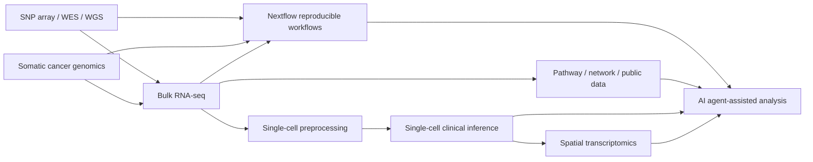

# 課程總綱

## 1. 課程定位

### 目標學員

- 臨床醫師、研究型醫師、醫事人員及臨床研究工作者
- 具備基礎分子生物學概念
- 不假設具備 R、Python、Nextflow 或 command-line 經驗

### 系列課程結束後的能力

學員應能：

1. 把臨床問題轉換為可分析的研究問題、比較組與主要 outcome。
2. 在 SNP array、panel、WES、WGS、bulk RNA-seq、single-cell RNA-seq 與空間轉錄體之間做出合理選擇。
3. 說明主要資料格式位於分析流程的哪個階段。
4. 判讀 QC、PCA、volcano plot、heatmap、UMAP、細胞比例圖及 spatial map。
5. 發現批次混雜、多重檢定、pseudoreplication、資料洩漏及因果過度推論。
6. 理解 Nextflow 如何讓分析流程可重現、可平行化並能續跑。
7. 把任務拆成 AI agent 可執行、但仍保有人工核准與獨立驗證的步驟。

## 2. 四個貫穿主軸

前三類基礎內容不獨立授課，而是隨案例出現。

| 主軸 | 嵌入方式 |
|---|---|
| 研究設計 | 每堂先提出臨床或研究分析問題，再定義研究單位、比較組、共變數、檢體與技術 |
| 檔案與資料流 | Array intensity、PLINK 與 VCF 在基因體課，count matrix 在轉錄體課，H5/H5AD 在 single-cell 課中介紹 |
| QC 與統計 | 依資料型態教適用指標，不提供跨技術通用的硬性 threshold |
| 可重現與可稽核 | 每堂保留輸入、參數、版本、輸出與限制；第 8、9 堂完成整合 |

## 3. 課程銜接

第 8 堂的 Nextflow 提供「可靠執行層」；第 9 堂的 AI agent 提供「規劃、工具選擇、解釋與稽核介面」。AI agent 不應取代已驗證的 workflow。

## 4. 每堂固定節奏

一般 omics 課程：

| 時間 | 活動 |
|---:|---|
| 0–10 分 | 臨床案例、決策點與研究問題 |
| 10–20 分 | 檢體、技術選擇、主要檔案 |
| 20–35 分 | 分析流程與核心原理 |
| 35–55 分 | 公開資料、圖表或工具示範 |
| 55–60 分 | 決策題與 take-home message |

Nextflow 與 AI agent：

| 時間 | 活動 |
|---:|---|
| 0–15 分 | 問題、概念與安全邊界 |
| 15–50 分 | 逐步 live demo |
| 50–60 分 | 錯誤排查、限制與決策題 |

## 5. 教學方法

- 每堂只保留 3 個主要 learning outcomes。
- 用一個臨床或研究分析情境貫穿整堂課，不羅列工具清單。
- 每張分析圖都回答三件事：輸入是什麼、圖上訊號是什麼、不能據此推論什麼。
- 講師示範操作，學員負責做選擇與判讀。
- 指令與程式碼放在講義，投影片只呈現資料流、關鍵參數及結果。
- 對於快速更新的平台，以不依賴品牌的概念為主，產品畫面為例。

## 6. 評量

- 第 1 堂開始前：10 題前測。
- 每堂結尾：1 題臨床決策題。
- 第 4、6、7 堂：各安排一次「找出不可信結論」練習。
- 第 8 堂：學員能用圖解說明 process、channel、workflow 與 `-resume`。
- 第 9 堂：學員能使用審核清單找出 AI 輸出的資料、程式或推論風險。
- 系列結束：重做前測並完成一頁式分析需求書。

詳細題目見 [learning-assessment.md](../assessment/learning-assessment.md)。

## 7. 備課與現場要求

- 講師電腦：macOS 或 Linux、投影、網路、瀏覽器。
- 第 8 堂：預先測試 Java、Nextflow、Docker；同時保留 stub-run 錄影或截圖。
- 第 9 堂：預先確認平台權限；若 Claude Science 或 GPT-Rosalind 無法使用，改以具檔案及終端工具能力的通用 agent 示範相同流程。
- 所有 demo 均保留靜態輸出，避免網路或平台故障導致無法授課。
- 不使用真實可識別病人資料。
