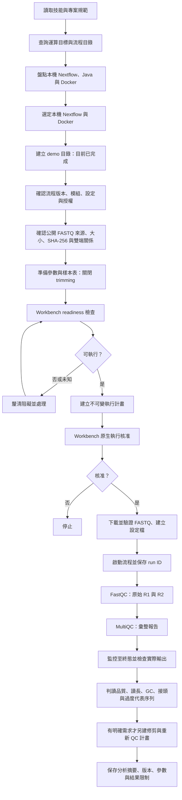

# NGS Analysis Workbench：公開 FASTQ QC 示範

本示範使用本機現有 Nextflow 與 Docker，學習原始 FASTQ 品質檢查及報告判讀。資料預計取自公開測試資料集；目前僅完成目錄準備與環境盤點，尚未下載 FASTQ 或執行 QC。

## 目錄

- `data/`：公開 FASTQ 與來源資訊；原始 FASTQ 不納入 Git。
- `config/`：經確認的參數與樣本表。
- `runs/<run-name>/`：由 Workbench 核准執行後建立，放置流程工作目錄、日誌與結果；不納入 Git。

候選流程為目錄中的 `nf-core/demo 1.2.0`。正式執行前需完成資料大小與 SHA-256 驗證、流程來源檢視、Docker 容器架構相容性及 Workbench readiness 檢查。第一輪關閉 trimming，使用 FastQC 與 MultiQC；是否修剪依實際報告判斷。QC 示範不支持臨床判讀或完整資料集品質結論。

## 執行流程

執行失敗時應檢查日誌與部分輸出，先說明阻礙；不得把流程完成狀態當成資料品質合格的證據。
