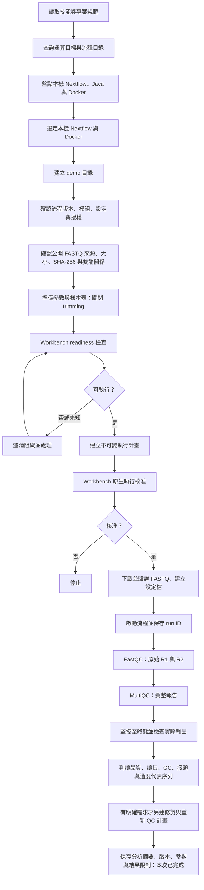

# NGS Analysis Workbench：公開 FASTQ QC 示範

本示範使用本機現有 Nextflow 與 Docker，學習原始 FASTQ 品質檢查及報告判讀。2026-10-05 已透過 Workbench 完成公開 SRR6357070 測試子集的 QC，沒有修剪讀序。詳見 [實際結果與限制](analysis_summary.md)。

## 目錄

- `data/`：公開 FASTQ 與來源資訊；原始 FASTQ 不納入 Git。
- `config/`：經確認的參數與樣本表。
- `runs/<run-name>/`：由 Workbench 核准執行後建立，放置流程工作目錄、日誌與結果；不納入 Git。

本次選定的最終教學報告與數值表已明確納入 Git；其餘執行暫存仍忽略。報告保留流程原生位置：[MultiQC HTML](runs/20261005-raw-qc/results/multiqc/SRR6357070-public-FASTQ-QC-demo_multiqc_report.html)、[R1 FastQC](runs/20261005-raw-qc/results/fastqc/SRR6357070/SRR6357070_1_fastqc.html)、[R2 FastQC](runs/20261005-raw-qc/results/fastqc/SRR6357070/SRR6357070_2_fastqc.html)。

已執行流程為 `nf-core/demo 1.2.0`，profile 為 `docker,emulate_amd64`。輸入的大小、SHA-256、gzip、FASTQ 結構與雙端名稱對應皆已驗證，共 50,000 對、每條 101 bp。Docker Desktop 啟動後確認有約 8 GB 記憶體，因此本次使用每工作最多 2 CPU／4 GB 的資源設定。第一輪關閉 trimming，使用 FastQC 與 MultiQC；是否修剪依實際報告判斷。QC 示範不支持臨床判讀或完整資料集品質結論。

## 執行流程

執行失敗時應檢查日誌與部分輸出，先說明阻礙；不得把流程完成狀態當成資料品質合格的證據。

本次執行至原始 QC 與摘要保存，未執行另一次修剪分析。MultiQC 在 AMD64 模擬模式下停用靜態圖匯出，HTML 與數值表已成功產生。
