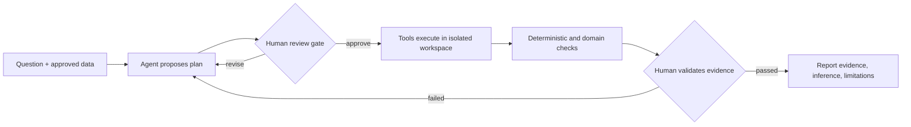

# Lesson 09 — 使用 AI Agent 輔助生物資訊分析

## 課程目標

完成本堂後，學員能：

1. 區分 model、agent、tool/connector/MCP、Skill 與 human review gate。
2. 將分析拆成 plan → approve → execute → verify → report。
3. 使用固定清單稽核 AI 產生的程式、數值、圖表、引用與推論。

## 臨床／研究案例

團隊取得一份去識別化 bulk RNA-seq count matrix，希望比較 Case 與 Control。研究人員要求 AI agent：

> 幫我找出差異基因、畫圖並告訴我重要 pathway。

資料中故意包含：

- Condition 與 batch 高度相關。
- 一筆 reported sex 與 expression marker 不一致。
- 樣本數不大。

本堂決策：agent 應先做什麼、何時停止、什麼需要人工核准？

## 60 分鐘流程

| 時間 | 段落 | 教學內容 | 現場操作 |
|---:|---|---|---|
| 0–8 | Agent 是什麼 | Model、agent loop、tool call、artifact | 把「回答問題」改寫成「執行任務」 |
| 8–15 | 科學工作介面 | Connector/MCP、Skill、provenance、reviewer | 比較 prompt 與 SOP-backed Skill |
| 15–23 | Plan only | 資料邊界、input contract、estimand、covariates、blockers | 送出 plan-only prompt |
| 23–30 | 人工核准 | 審查計畫、修正 contrast、禁止任意排除 sample | 使用 review checklist |
| 30–42 | Execute | 允許建立隔離輸出目錄、產生與執行程式 | 觀察 tool calls 與 artifacts |
| 42–50 | Verify | Deterministic preflight、數值重算、圖表與 code 對照 | 執行 `reference_checks.py` |
| 50–55 | Skill 比較 | 同任務使用 ad-hoc prompt 與 `audit-rnaseq-analysis` | 比較穩定性及漏項 |
| 55–60 | 決策題 | 程式成功執行是否代表分析正確？ | 分類 evidence/inference |

## 核心工作流



## 名詞

| 名詞 | 課堂定義 | 不能誤解為 |
|---|---|---|
| Model | 產生、理解與推理的基礎模型 | 自動擁有資料或工具權限 |
| Agent | 依目標規劃、呼叫工具、觀察結果並繼續的系統 | 無需監督的專家 |
| Tool | 可被呼叫的程式、資料庫或 API | 輸出一定正確 |
| Connector / MCP | 讓 agent 以結構化介面存取外部系統 | 自動取得所有權限 |
| Skill | 包含 instructions、scripts、references、output contract 的可重用 SOP | 只是較長的 prompt |
| Review gate | 人員在高影響動作前核准或拒絕 | 事後才看最後摘要 |

## 平台案例

### Claude Science

用來示範科學工作台、skills/connectors、計算資源與 auditable artifacts。平台功能與 beta 狀態需在上課前重新查核。

- 官方來源：[Claude Science](https://www.anthropic.com/news/claude-science-ai-workbench)

### GPT-Rosalind / Codex

用來示範生命科學推理、科學工具、資料庫、Skills 與可重複工作流程。GPT-Rosalind 的 research-preview 資格與地域／組織存取條件需在上課前重新查核。

- 官方來源：[GPT-Rosalind](https://openai.com/index/introducing-gpt-rosalind/)

### Vendor-neutral fallback

若上述平台無法使用，使用具備：

- 本機檔案存取
- 終端／Python 或 R tool
- 明確 approval gate
- 可保存 prompt、code 與 outputs

的通用 agent 重做相同示範。課程成效不得依賴特定品牌畫面。

## Live demo

完整材料位於 [demos/ai-agent](../demos/ai-agent)。

### 1. 先執行 deterministic reference check

```bash
python3 demos/ai-agent/reference_checks.py \
  --counts demos/ai-agent/data/counts.csv \
  --metadata demos/ai-agent/data/metadata.csv
```

此結果是 agent 必須至少發現的 input-level evidence，不是完整差異表現答案。

### 2. Plan-only

使用 [`prompts/01-plan-only.md`](../demos/ai-agent/prompts/01-plan-only.md)。要求 agent：

- 不執行分析、不修改檔案。
- 列出研究單位、contrast、covariates、input validation 與 blockers。
- 指定哪些決策必須由人員核准。

### 3. Human approval

依 [`human-review-checklist.md`](../demos/ai-agent/human-review-checklist.md) 審查。講師只核准：

- 讀取指定的公開教學資料。
- 在新的 `outputs/` 內建立 artifacts。
- 先做 sample alignment、library size、condition × batch 及 marker mismatch checks。

不核准：

- 自動移除樣本。
- 自動修改 condition/batch/sex metadata。
- 自行挑 threshold 直到得到顯著結果。

### 4. Execute after approval

使用 [`prompts/02-execute-after-approval.md`](../demos/ai-agent/prompts/02-execute-after-approval.md)，要求保留：

- Analysis plan
- Environment/package versions
- Code
- Standard output/error
- Figures/tables
- Exclusion/threshold log
- Final evidence/inference/limitations report

### 5. Audit

使用 [`prompts/03-audit-results.md`](../demos/ai-agent/prompts/03-audit-results.md)。以 [`expected-findings.md`](../demos/ai-agent/instructor/expected-findings.md) 做講師稽核。

### 6. Skill comparison

讓 agent 使用 [`audit-rnaseq-analysis`](../demos/ai-agent/skills/audit-rnaseq-analysis/SKILL.md) 重做 plan-only 階段，比較：

- 是否先確認資料邊界。
- 是否發現 condition–batch association。
- 是否把 sex-marker mismatch 當成「待查核」而不是自行改標籤。
- 是否保留人員核准點。
- 是否區分 evidence 與 inference。

## 必須教清楚的限制

- 不將可識別病人資料、院內機密或未核准資料上傳到外部 AI 服務。
- Agent 的語氣流暢、工具執行成功、code 無 syntax error，都不等於科學結論正確。
- 不能由 agent 單獨決定排除病人、修改 metadata、改主要 outcome 或反覆調 threshold。
- 引用必須回到原始來源；數值必須能從 artifacts 重算。
- 生物學解釋必須分為 observed evidence、model-dependent inference 與 speculation。
- Agent 應協助操作既有 validated workflows，而不是每次即興重寫 production pipeline。
- Clinical interpretation 與病人照護決策由具資格人員負責。

## 決策題

**題目：** Agent 執行完程式、沒有 error，且產生一張漂亮的 PCA 和 200 個顯著基因，是否代表分析成功？

**正確決策：** 不代表。

**理由：** 仍需核對 sample IDs、metadata、batch confounding、analysis unit、model design、code、版本、數值與圖表；本教學資料尤其包含已知 input-level 風險。

## 講師檢查

- [ ] Demo data 不含病人資料
- [ ] Agent 權限限定在教學資料與新輸出目錄
- [ ] 先 plan 再 execute
- [ ] 至少拒絕一次不合理 agent 建議
- [ ] 使用 deterministic script 獨立核對 agent
- [ ] 保存完整 prompt 與 artifact history
- [ ] 上課前重新確認產品名稱、功能與存取條件
